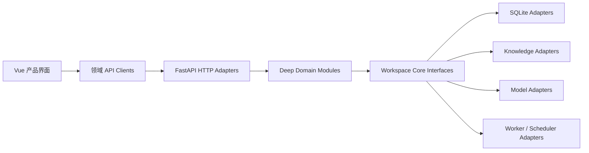

# Void System 总体设计

- 状态：ACTIVE
- 最近更新：2026-07-18
- 适用范围：仓库内后端、前端、数据库迁移、AI 集成、测试与产品文档

## 1. 文档目的

本文定义 Void System 的目标产品形态、规范架构、核心流程和交付边界。它不是功能愿望清单，也不用于替运行时缺陷辩护。任何“页面已经有了但接口未接通”“路由已经有了但 Module 未组合”“数据库能保存但刷新后页面丢失”“测试接口成功但实际模型调用失败”的情况，都属于未完成实现。

本文描述目标设计；实际运行接口由 OpenAPI 和数据库 Schema Contract 精确表达。二者不一致时必须把差异登记为缺陷并修复，不能选择性引用其中一份来宣称功能完成。

## 2. 依据与优先级

项目资料按以下顺序使用：

1. `docs/adr/`：已经接受的架构决策。若要改变，新增 ADR，不在代码中暗改。
2. `DESIGN.md`：产品与系统的总体目标设计。
3. `CONTEXT.md`：统一领域语言、概念定义和架构不变量。
4. 后端 OpenAPI、迁移历史与数据库约束：当前运行时公共接口和持久化事实。
5. `docs/api-contract.md`：前端允许依赖的接口使用约定。
6. `PROJECT_RULES.md`：实现、测试、注释和交付规则。
7. 代码与测试：当前实现及其可验证证据。

旧计划、历史报告和归档文件只用于理解演进过程，不得覆盖 ACTIVE 文档。

## 3. 产品定位

Void System 是面向个人成长、学习和长期目标推进的工作台。系统把用户意图转化为可审阅的计划、可恢复的执行、可核验的成果、可解释的复盘和后续行动，同时让个人知识、长期记忆、用户画像与 AI 协作在用户授权下参与这一闭环。

核心闭环是：

`Goal -> Plan Draft -> Run -> Step/Action -> Artifact/Evidence -> Review -> Growth -> Next Goal`

产品首先服务普通用户。Provider、向量索引、提示词、JSON 字段、cron、模型上下文窗口等实现概念只出现在管理员或高级诊断界面。

## 4. 设计目标

1. **一个执行事实源**：Goal、Run、Step、Action、Event、Artifact、Approval 是唯一任务执行模型。
2. **刷新可恢复**：耗时操作和执行状态持久化，页面刷新、切换设备或进程重启后仍可继续查看。
3. **跨层完整**：每项能力从领域合同、Module、Adapter、Schema、HTTP、前端 client、UI 到测试形成完整纵向交付。
4. **AI 可替换**：模型发现、连接测试、运行调用、流式解析和结构化输出使用同一份规范连接配置，不依赖特定厂商名称猜测能力。
5. **用户可控的个性化**：画像与记忆有来源、权限、置信度、审核和删除能力，不进行无声推断或全量上下文注入。
6. **可迁移内核**：Workspace Core 不依赖当前前端外壳、SQLite、Chroma、LangChain 或具体模型供应商。
7. **可运营**：错误可定位、异步进度可观察、迁移可审计、失败可重试、危险操作可恢复。

## 5. 非目标

- 不维护“单任务、任务链、自动任务”三套执行架构。
- 不为了兼容历史页面而永久保留旧运行时路由、旧表或双写投影。
- 不让 AI 直接写入不可解释、不可纠错的最终画像。
- 不把商城、积分或系统精灵做成脱离目标执行闭环的装饰功能。
- 不把模型供应商配置暴露为普通用户必须理解的产品设置。
- 不以页面能打开、接口返回 200 或单个 helper 测试通过作为功能完成标准。

## 6. 规范架构

### 6.1 分层职责

| 层 | 允许承担的职责 | 禁止承担的职责 |
| --- | --- | --- |
| 产品界面 | 用户流程、显示状态、输入校验、无障碍和恢复入口 | 拼接临时 HTTP、猜测数据库状态、暴露内部枚举 |
| 领域 API Client | 请求结构、响应解包、认证重试、SSE 解析 | 页面布局、领域状态机、供应商特例散落 |
| HTTP Adapter | 鉴权、传输模型、错误映射、调用 Module | 领域规则、跨表事务、直接模型编排 |
| Domain Module | 用例、状态机、权限规则、幂等、事务语义 | FastAPI/Vue 类型、具体数据库细节 |
| Core Interface | 合同、类型、不变量、错误模式 | 具体 SDK、框架对象、环境变量读取 |
| Adapter | SQLite、模型、索引、文件、队列等具体实现 | 改写领域规则或绕过 Module |

### 6.2 组合规则

- 应用启动在一个明确的 composition root 中创建并注入 Adapter 和 Module。
- 路由不得自行创建数据库连接、模型 client 或隐藏的第二套配置。
- 同一能力只能有一个规范 Module。Facade 只有在减少调用方复杂度时才保留。
- 只有一个实现时不要虚构可插拔性；存在第二个实际 Adapter 或明确测试替身时，Interface 才证明有价值。

## 7. 核心 Module

| Module | 负责 | 不负责 |
| --- | --- | --- |
| Identity | 注册、登录、令牌、角色、owner 身份 | 业务数据权限规则 |
| Conversations | 分组、会话、消息和附件引用 | 长期记忆与画像结论 |
| Knowledge Engine | 资料生命周期、索引、检索、重排、回答、引用与质量评估 | 用户画像、任务执行 |
| Planning Engine | 将 Goal 意图和允许的上下文生成可审阅 Run 草稿 | 自动发布、执行状态、奖励结算 |
| Task Execution | Goal、Run、Step、Action、Event、Artifact、Approval、Lease、Checkpoint | 定时器和外部事件来源 |
| Task Automation | Trigger、Trigger Firing、Run Command | 另一套任务状态机 |
| Personal Context | 权限、Observation、Claim、Override、Memory、Context Compiler、访问审计 | 直接查询其他 Module 私有表 |
| Growth | Capability、成长记录和由完成事实驱动的变化 | 独立任务完成判定 |
| Reward Marketplace | 可选的奖励目录、兑换和权益履约 | 没有实际权益的装饰商城 |
| Administration | 系统连接、共享知识和运行配置 | 普通用户偏好设置 |
| Analytics | 基于规范事件和读模型统计 | 修改业务事实 |

Reward Marketplace 是可选 Module。只有当兑换能解锁明确服务、内容、能力或用户选择，并且具备库存/额度、履约、退款或失败补偿语义时才进入产品主流程；否则保留数据迁移能力但不展示入口。

## 8. 规范业务流程

### 8.1 目标与规划

1. 用户描述期望结果和约束。
2. 后端创建持久化 `Plan Generation Job`，立即返回 job 标识。
3. Worker 领取 job，按阶段更新进度并生成结构化 Plan Draft。
4. 前端通过轮询或事件流读取权威状态；刷新后依据 job 标识恢复。
5. 用户审阅和修改 Goal、Step、依赖、完成条件和推进方式。
6. 发布操作使用稳定幂等键，在一个应用用例中创建或复用 Goal 与 Run。
7. 发布失败返回可恢复阶段，不留下用户无法理解的半成品。

`POST /api/plans` 和 `/api/ai/advisor` 这类同步/旧形状生成接口只能作为有明确退役日期的兼容入口。第一方前端必须使用持久化 job 流程。

### 8.2 执行与复盘

1. Run 状态只能由 Task Execution 转换。
2. Step 依赖、重试、跳过、失败、Approval 和并发条件由同一 Module 校验。
3. 每次有意义的变化写入 append-only Event。
4. Artifact 和 Evidence 是可审阅成果，不是前端临时文本。
5. Review 读取权威完成事实、成果、评估和 Reward Settlement，不在浏览器推测。
6. 一次完成只能产生一次结算；重试请求必须幂等。

### 8.3 自动启动与系统协助

- Trigger 只决定何时创建 Run。
- 当前执行方式只有“自己完成”和“系统协助”：前者由用户确认完成，后者由用户提交成果后由系统精灵审阅。
- 系统精灵可以在两种方式中回答问题，但不会因为一次对话自动改变任务状态。
- 调度器、Webhook 和未来 worker 都是 Adapter，不拥有新的任务模型。未来自动执行必须先提供可恢复作业、最小权限工具、审批、进度、取消和审计，再通过新的 ADR 开放。
- 用户界面使用“启动条件”“调整要求”“等待确认”等产品语言，并提供解释性副文案。

### 8.4 个人上下文

画像链路固定为：

`Observation -> Claim -> User Override -> Effective Profile`

Context Compiler 必须接收 purpose、允许 section、敏感度和预算；输出选择原因、来源、新鲜度、截断情况和访问审计。模型只获得本次用途需要的最小上下文。

### 8.5 知识流程

资料上传、准备、检索、回答和索引维护是可恢复流程。回答只使用所选证据，返回引用与支持状态。索引是可重建派生数据，源资料及其 owner 权限才是持久化事实。

## 9. 持久化异步工作

所有预计超过普通 HTTP 请求时限、依赖外部模型/索引或需要刷新恢复的操作，都使用统一 Job 合同：

- `job_id`、owner、kind、status、stage、progress
- 输入快照或稳定引用
- created/started/updated/completed 时间
- attempt、worker lease、heartbeat、cancel_requested
- result reference、结构化错误、retryability
- append-only progress/event 记录

允许状态至少包括 `queued`、`running`、`succeeded`、`failed`、`cancelled`。进度是服务端事实，不能由前端计时器伪造。

FastAPI `BackgroundTasks` 只能作为轻量派发手段，不能承担可靠执行本身。进程重启后必须能扫描并恢复未完成 job；多个 worker 必须通过领取或 lease 避免重复执行。

## 10. AI 与模型接入

### 10.1 规范连接配置

模型发现、连接测试、聊天、规划、画像推断和知识回答都读取同一个规范化连接档案：

- provider kind
- base URL
- credential reference
- model id
- capability profile
- timeout、retry 和流式偏好

密钥不返回前端，不写入日志，不存浏览器。环境变量与管理员设置必须有明确优先级，并在管理页显示当前有效来源。

### 10.2 能力探测

系统不得仅凭模型名称判断能力。连接测试应分别验证：

- 模型列表发现
- 非流式文本
- 流式 SSE
- 结构化 JSON 或受约束输出
- 超时和错误格式

运行时根据已验证能力选择调用方式。例如模型非流式 `content` 为空但流式可用时，规范 Adapter 应选择流式聚合，而不是让每个业务 Module 各写一个补丁。

### 10.3 输出合同

- 结构化业务结果必须经过 schema 校验。
- 允许一次受控修复或降级；不能无限重试。
- 失败要保留可理解错误、request/job id 和重试建议。
- 思考过程不作为产品消息保存或展示；仅展示最终答复和允许的状态说明。

## 11. 数据与迁移

- Schema 只通过有序迁移演进，不在运行请求中临时改表。
- 迁移历史必须是当前 Schema Contract 的连续、名称匹配前缀。
- 历史模型采用一次性迁移：校验、转换、记录映射、验证数量、删除旧运行时代码，最后删除旧表。
- 兼容层必须有 ADR、负责人、截止版本、迁移路径和删除条件。
- JSON 字段必须有明确 shape、统一编码/解码和数据库约束；对象字段不能接受字符串化对象或数组。
- 数据删除需要 owner 校验、引用处理、审计和必要的恢复期。

## 12. HTTP 与前端合同

- `/api/openapi.json` 描述字段级运行合同。
- 所有普通 JSON 响应使用统一 success/error envelope；SSE 端点使用统一 event 合同。
- 写请求返回提交后的权威资源快照或可读取它的 job/resource id。
- 错误分支使用稳定 `error_code`，用户文案使用 `message`，诊断依靠 `request_id`。
- 前端页面只调用 `src/api/` 中的领域 client；禁止页面直接拼接 URL。
- client 负责认证刷新、响应解包、取消和协议解析；页面负责用户旅程。
- 删除或替换接口时，同步修改 OpenAPI、client、页面、测试和 `docs/api-contract.md`。

## 13. 前端体验

产品界面按“目标、计划、行动、成果、复盘、成长”组织，而不是按数据库表和后端 Module 组织。

每个网络流程必须设计：

- 初始、加载、空、成功、失败、重试、无权限状态
- 耗时任务的后台进度、最小化入口和刷新恢复
- 危险操作的影响说明与确认
- 用户可理解的时间、状态和下一步
- 桌面与移动布局、键盘操作、焦点、对比度和文本溢出

设置页按用户意图分组。普通设置包含陪伴方式、隐私、通知和账户；模型、索引、数据库与诊断属于管理员区域。

## 14. 安全与隐私

- 所有用户资源 owner-scoped，不能依赖前端隐藏按钮实现权限。
- 管理员操作、画像读取、Agent 执行和敏感配置变更必须可审计。
- 管理员账号由部署流程或显式 bootstrap 创建；测试不能重置真实凭据。
- 日志和错误响应不得包含 token、密码、API key、原始敏感资料或模型内部思考。
- 用户可以查看、纠正、停用和删除画像/记忆来源。

## 15. 纵向交付矩阵

每项功能在适用范围内必须同时完成：

| 交付项 | 必须回答的问题 |
| --- | --- |
| Domain Contract | 概念、状态、不变量和错误是什么？ |
| Module | 哪个用例拥有规则和事务？ |
| Adapter | 数据或外部系统怎样实现 Interface？ |
| Schema/Migration | 如何持久化、约束、升级和回退？ |
| HTTP/OpenAPI | 前端如何调用、鉴权和处理错误？ |
| Frontend Client | 是否只有一个规范调用入口？ |
| UI Workflow | 普通用户如何完成整段流程？ |
| Recovery | 刷新、重试、取消、重启后怎样恢复？ |
| Tests | Module、Adapter、HTTP、前端和闭环如何证明？ |
| Documentation | 哪些 ACTIVE 文档需要同步？ |

任何适用项缺失时，功能状态只能是“进行中”或“阻塞”，不得标记完成。

## 16. 当前已知缺口与实施顺序

### P0：合同收口

- 清除 API 合同、旧计划和实际路由之间的 legacy task 矛盾。
- 建立自动检查，防止已退役路由重新进入 OpenAPI 或前端 client。
- 逐个建立功能纵向矩阵，识别页面、接口、Module、表和测试缺口。

### P1：可靠异步与计划发布

- 将计划生成从“持久化记录 + 进程内 BackgroundTask”升级为可领取、可恢复的 durable worker job。
- 第一方前端只使用异步 job；同步 `/api/plans` 与旧形状 `/api/ai/advisor` 明确退役。
- 将 Plan Draft 持久化，并提供幂等、可恢复的 Goal + Run 发布用例。
- 所有耗时 AI/索引操作复用统一 Job 与进度呈现。

### P2：AI 运行一致性

- 统一发现、测试、运行、流式和结构化输出的连接 Adapter。
- 为不同上游兼容实现 capability probe 和契约测试。
- 让画像、规划、对话、知识调用通过 Context Compiler 与同一运行配置。

### P3：前端工作流与视觉系统

- 按核心用户旅程重组导航和设置。
- 建立统一状态、反馈、表单、空状态和后台任务中心。
- 对所有页面执行桌面/移动视觉、可访问性和真实 API 闭环验收。

### P4：知识、画像与长期记忆闭环

- 建立可评估的检索数据集、引用质量和索引恢复流程。
- 将模型画像限制为可审阅 Claim，并允许用户覆盖和撤销。
- 让 Planning/Companion 按 purpose 获取最小上下文，并展示来源。

### P5：成长与可选商城

- 统一 Review、Reward Settlement 和 Capability 变化。
- 只有在商品权益、履约和失败补偿完整时恢复商城入口，否则删除产品表面和无价值代码。

## 17. 完成定义

一项功能只有在以下条件全部满足时才完成：

1. 规范路径唯一，旧运行时代码已经删除或有有效 ADR 限期。
2. 适用的纵向交付项全部实现。
3. 权限、错误、刷新恢复、取消和重试已经验证。
4. 后端与前端使用同一接口合同，没有页面私有协议。
5. 代码注释和文档说明责任、输入输出、调用场景、不变量与失败行为。
6. 自动测试、生产构建和真实浏览器核心闭环通过。
7. 数据迁移对历史数据有计数、校验和失败策略。
8. ACTIVE 文档与运行时一致。
9. 交付报告列出确切命令、结果、未完成项和残余风险。

## 18. 重构执行治理

本项目的重构不是按页面、文件或“看起来能用”来计算进度，而是按一个用户可完成、可恢复、可验证的领域能力计算。每一轮只允许推进一个可命名的纵向能力批次；例如“持久化 Plan Draft 的创建、编辑、发布与刷新恢复”，而不是笼统地“优化任务模块”。

每个批次必须先在 `docs/audits/` 登记现状、根因、受影响层、数据迁移策略、删除目标和验收命令，再按以下门禁推进：

1. **合同门禁**：领域状态、owner 范围、错误码、幂等键和迁移目标已明确；没有这些信息不得先做页面。
2. **后端门禁**：Module、Adapter、事务、Schema/Migration 和 HTTP/OpenAPI 已形成一条规范路径；临时兼容不能成为第一方调用路径。
3. **客户端门禁**：前端 client、路由和页面只消费规范 API，且展示服务端权威状态，而不是本地拼装或猜测状态。
4. **恢复门禁**：刷新、重复提交、取消、重启、超时和权限变化有明确且已测试的结果。
5. **删除门禁**：替代路径验证通过后，删除旧路由、旧 client、旧页面状态、旧测试夹具和误导性文档；只允许保留一次性迁移支持代码。
6. **证据门禁**：测试、构建、必要的真实浏览器闭环和 ACTIVE 文档均已更新。任何一项缺失时，批次状态只能是 Partial 或 Blocked。

进度必须以审计矩阵中的“已实现且已验证能力数 / 适用能力总数”描述，并同时列出未完成的纵向项。禁止以文件数量、路由数量或主观百分比作为完成依据。

## P2.1 Canonical AI Runtime Connection (Implemented)

The model provider selector is not a diagnostic-only setting. One immutable
ModelConnectionProfile resolves provider aliases, protocol, endpoint, model,
credential requirements, and provider request options. Administration model
discovery, connection verification, chat, planning, personal-context inference,
and embeddings consume this resolution rather than independently interpreting
provider names.

- Unknown providers, missing credentials, missing endpoints, and missing model
  selections fail with stable AI_* codes. They never silently call Ollama or a
  different installed model.
- LM Studio is resolved as an OpenAI-compatible local endpoint beneath /v1 with
  a local placeholder key and chat_template_kwargs.enable_thinking=false. The
  same request options are used by test and runtime clients.
- Embedding provider resolution is distinct from chat provider resolution. A
  local chat endpoint is not assumed to provide compatible embeddings.
- Saving AI settings publishes a replacement RuntimeSettings snapshot. Existing
  requests keep their captured snapshot; later requests and background planning
  obtain the new snapshot. AI-bound knowledge resources are invalidated and
  lazily rebuilt after publication.

## P2.2 Snapshot-bound AI Transport

Chat and vision transports must be constructed from the settings snapshot that
was resolved for the request or background job. A long-lived stream must not
look up mutable global configuration after it starts.

- Persona text and multimodal streams capture the same configured chat client.
  The multimodal branch cannot silently revert to the process-global provider.
- Image caption and knowledge-image extraction accept explicit RuntimeSettings
  and pass them to the canonical factory.
- Profile inference expresses only its output budget. Provider request options,
  including LM Studio's disabled thinking mode, remain exclusively in the
  canonical connection profile.
- HTTP and SSE map configuration failures to safe, stable AI_* codes. Upstream
  failures use AI_UPSTREAM_UNAVAILABLE and never expose endpoint credentials.

This closes the code-level P2 transport contract. It remains subject to a live
LM Studio smoke test while the service is listening on 127.0.0.1:1234.

## P2.3 Validated Task Evaluation

Task-evidence review is a model-assisted decision boundary, not an arbitrary JSON
pass-through. The evaluator consumes task metadata, submitted evidence, and
user-attribute context, then returns a validated `pass` or `fail` decision,
a 0-100 score, feedback, and non-negative suggested rewards. Invalid model
output becomes an explicit safe failure. A `fail` decision always zeros every
suggested reward before the result may reach task progression or reward code.

## P2.4 Private Knowledge At-Rest Encryption (Implemented and migrated)

Private library content uses one application-composed Fernet cipher across managed source files, SQLite previews, and Chroma document bodies. The system chunks and embeds only in trusted worker memory; personal Chroma bodies persist as ciphertext and are decrypted only after owner-scoped catalog eligibility is resolved. Source and index encryption versions are tracked separately; source maintenance also migrates historical filenames to opaque document-id `.bin` paths so encrypted content does not retain a filename leak in managed storage.

This is content-level encryption, not whole-store encryption. Vector embeddings and operational metadata remain outside this boundary, and complete database/vector-file encryption requires a separate SQLCipher or encrypted-volume decision with key rotation. Official material remains shared by access policy and is therefore not silently converted into private content. See ADR-0009 and the private-knowledge encryption audit for exact scope and verification status.
